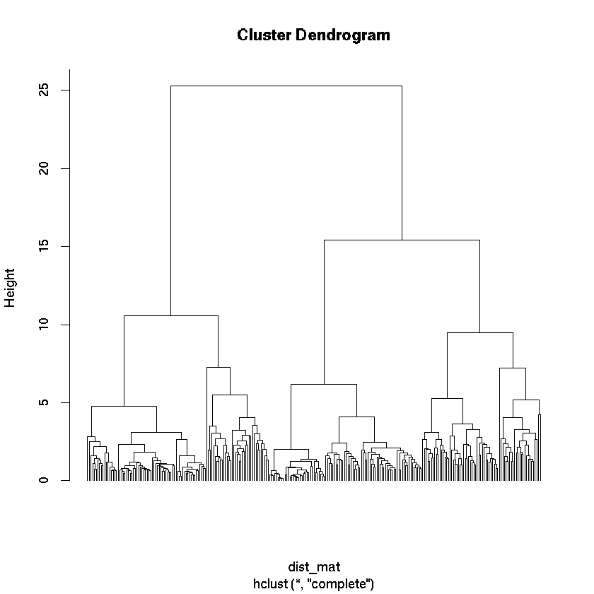

```{r setup, include=FALSE}
knitr::opts_chunk$set(echo = TRUE)
library(tidyverse)
library(glmnet)
```


##### Background Questions
1. EGPD Diagram

* E: None
* G: None
* P: DNA Methylation
* D: Age and cancer

2. DNA methylation refers to cytosine-5 methylation within CpG dinucleotides. DNA methylation in promoter regions silences gene expression by preventing transcription factor binding, thereby leading to cellular differentiation.

3. Methylation markers are detected using Illumina Methylation Assay, which is built upon bisulfite sequencing. Bisulfite sequencing works by treating DNA with bisulfite which converts unmethylated cytosine to uracil via hydrolytic deamination, then subsequent sequencing can determine the methylated and unmethylated sites based on the conversion patterns.

4. Horvath used the `glmnet` library for the implementation of elastic nets. The function build out the regression model is `glmnet(x=methylationIndicators, y=age)`.

5. In the models build by GWAS and EWAS, the response variables are binary variables (eg. Have T2D or do not have T2D). In the linear model approach used by Horvath, the response variables are continous variables (age). In GWAS/EWAS, the predictors are significant SNP deviations from healthy controls to diseased populations as a result of a proportions test, but in linear models, the predictors are methylation markers that have significant coefficients in the model after penalization factors. This means that the approach to multiple hypothesis testing is different. in GWAS/EWAS, we define a FDR or a Bonferonni threshold to call significant, but in linear models, we penalize for added coefficients vs the predictive power of the model (eg. cost-benefit).

6. The average age acceleration is the average difference between the predicted DNAm age and the chronological age of the cell. By comparing and constrasting the DNAm age and the chronological age, the differences in age acceleration of different tissue types from the same subject can infer disease state (eg. cancer tissues) or physical and mental fitness. 

7. Training=656, Test=95


##### Prediction Age

Load data files
```{r eval=F}
load(file="data/GSE40279_r2.Rdata")
load(file="data/GSE41169_r2.Rdata")
```

##### 1.1) Getting age information
```{r eval=F}
# Age is stored in `characteristics_ch1` for training and 
#`characteristics_ch1.6` for test in the metadata dataframes

# parse the strings and extract the age information
train.age  <- sapply(as.character(gse40279.meta$characteristics_ch1),
                     function(ch) as.numeric(unlist(strsplit(ch, ' '))[3]))
test.age  <- sapply(as.character(gse41169.meta$characteristics_ch1.6),
                     function(ch) as.numeric(unlist(strsplit(ch, ' '))[2]))

# remove names
names(train.age)  <- NULL
names(test.age)  <- NULL
```

##### 1.2) Finding common probes
```{r, eval=F}
# find common probes
train.probes  <- rownames(gse40279.data)
test.probes  <- rownames(gse41169.data)
common.probes  <- intersect(rownames(gse41169.data), rownames(gse40279.data))

# only select the common probes in training and test datasets
train.common  <- gse40279.data[common.probes,]
test.common  <- gse41169.data[common.probes,]

# number of common probes
length(common.probes)
```

There are 118271 common probes between the training and test set


##### 2) Exploring training and test set

For training set:
```{r, eval=F}
# summarize the ages in the training dataset
summary(train.age)
mean(train.age)
sd(train.age)
length(train.age)
```

Min. = 19.00

1st Qu. = 54.00

Median = 65.00

Mean = 64.04

3rd Qu. = 75.00

Max. = 101.00

Mean = 64.0350609756098

Standard Deviation = 14.7366808073477

N = 656


For test set:
```{r, eval=F}
# summarize the ages in the test dataset
summary(test.age)
mean(test.age)
sd(test.age)
length(test.age)
```

Min. = 18.00

1st Qu. = 24.50

Median = 29.00

Mean = 31.57

3rd Qu. = 36.00

Max. = 65.00

Mean = 31.5684210526316

Standard Deviation = 10.282863902318

N = 95

##### 3) Impute missing values
```{r, eval=F}
# inpute missing values based on means
imputeData  <- function(probeData) {
    probeData[is.na(probeData)]  <- mean(probeData, na.rm=T)
    return(probeData)
}
train.common.imputed  <- t(apply(train.common, 1, imputeData))
test.common.imputed  <- t(apply(test.common, 1, imputeData))
```

##### 4) Predict ages
```{r, eval=F}
# Train glmnet for prediction
glmnet.Training.CV  <-  cv.glmnet(t(train.common.imputed), train.age,
                                  nfolds=10,alpha=0.5,family="gaussian")

# The definition of the lambda parameter:
lambda.glmnet.Training  <-  glmnet.Training.CV$lambda.min 
print(lambda.glmnet.Training)

# calculate the coefficients at the minimum lambda value
glmnet.coef  <- coef(glmnet.Training.CV, s=lambda.glmnet.Training)

# write out the coefficients
write.table(as.matrix(glmnet.coef), file='coefficients.csv', col.names = F, sep="\t")
```

The lambda is shrinkage parameter -- "penalization factor" for the coefficient.

Lambda min = 0.6413943

##### 5) R^2 and correlations

```{r, eval=F}
# R^2 and correlation for training set
print(cor(pred.age.train, train.age)^2)
print(cor(pred.age.train, train.age))

# R^2 and correlation for training set
print(cor(pred.age.test, test.age)^2)
print(cor(pred.age.test, test.age))
```

For training set:

R^2 = 0.9663555

R = 0.9830338

For test set:

R^2 = 0.9007898

R = 0.9490995

##### 6) Plotting predicted vs actual age
```{r, eval=F}
# plotting predicted age vs actual age in training set
plot(y=pred.age.train, x=train.age, ylab="Predicted Age", xlab="Actual Age", 
     main="Actual Age vs Predicted Age in Training Set")
```


```{r, eval=F}
# plotting predicted age vs actual age in test set
plot(y=pred.age.test, x=test.age, ylab="Predicted Age", xlab="Actual Age", 
     main="Actual Age vs Predicted Age in Test Set")
```


##### 7) Age acceleration and deceleration in test set
```{r, eval=F}
# Age accelerated
length(which(test.age > pred.age.test))
# Age decelerated
length(which(test.age < pred.age.test))
```

Age acceleration = 46

Age deceleration = 49


##### Bonus

##### 1)
```{r, eval=F}
# test if age acceleration and deceleration is different
# between genders in the training set
train.gender  <- gse40279.meta$characteristics_ch1.3
train.females  <- which(train.gender=="gender: F")
train.males  <- which(train.gender=="gender: M")
train.females.acc  <- length(which(train.age[train.females] > pred.age.train[train.females]))
train.females.dec  <- length(which(train.age[train.females] < pred.age.train[train.females]))
train.males.acc  <- length(which(train.age[train.males] > pred.age.train[train.males]))
train.males.dec  <- length(which(train.age[train.males] < pred.age.train[train.males]))

chisq.test(
    matrix(
        c(train.females.acc, train.males.acc, 
          train.females.dec, train.males.dec), 
        ncol=2), correct=F)

# again test for the test set
test.gender  <- gse41169.meta$characteristics_ch1
test.females  <- which(test.gender=="gender: Female")
test.males  <- which(test.gender=="gender: Male")
test.females.acc  <- length(which(test.age[test.females] > pred.age.test[test.females]))
test.females.dec  <- length(which(test.age[test.females] < pred.age.test[test.females]))
test.males.acc  <- length(which(test.age[test.males] > pred.age.test[test.males]))
test.males.dec  <- length(which(test.age[test.males] < pred.age.test[test.males]))

chisq.test(
    matrix(
        c(test.females.acc, test.males.acc, 
          test.females.dec, test.males.dec), 
        ncol=2), correct=F)
```

Pearson's Chi-squared test - Training Set

X-squared = 1.4016, df = 1, p-value = 0.2365


Pearson's Chi-squared test - Test Set

X-squared = 0.49211, df = 1, p-value = 0.483


Both the Chi-squared test for male and female proportions of have a p-value of more than 0.05, so we do not have enough evidence to claim that the age acceleration between males and females are different.

##### 2)
```{r, eval=F}
# sort the top coefficients
glmnet.coef.sorted  <- as.matrix(glmnet.coef)
glmnet.coef.sorted  <- glmnet.coef.sorted[order(-abs(glmnet.coef.sorted)), , drop=F]
#filter out 0
glmnet.coef.sorted  <- glmnet.coef.sorted[glmnet.coef.sorted != 0, , drop=F]

#convert to dataframe
glmnet.coef.sorted  <- as.data.frame(glmnet.coef.sorted)

# get the mappings
source("https://bioconductor.org/biocLite.R")
biocLite("IlluminaHumanMethylation450kanno.ilmn12.hg19")
library(FDb.InfiniumMethylation.hg19)

# map the probes to the genes
hm450 <- get450k()
probeset  <- rownames(glmnet.coef.sorted)[2:length(rownames(glmnet.coef.sorted))]
probes <- hm450[probeset]
genes  <- getNearestTSS(probes)$nearestGeneSymbol
write.csv(genes, file='genes.csv', sep="\t")
```

##### 3)

```{r, eval=F}
# get correlation matrix and do PCA
cor.matrix  <- cor(train.common.imputed[probeset,])
pca  <- prcomp(cor.matrix)

pca.summary  <- summary(pca)
ind <- which(pca.summary$importance["Cumulative Proportion",] > 0.9)
ind[1]
```

`PC4: 4`

The first 4 principal components explains for more than 90% of the variance. This implies 


##### 4)

```{r, eval=F}
# hierarchial clustering
dist_mat <- dist(train.common.imputed[probeset,])
clustering <- hclust(dist_mat, method = "complete")
plot(clustering, labels = F, hang=-1)

# cut it into 30 clusters
cut  <- cutree(clustering, k=30)

# find the clusters related to our top 3 probes
probeset.top  <- cut[which(cut == cut[probeset[1:3]])]

# get the genes related to the probes
probes <- hm450[names(probeset.top)]
genes.top  <- getNearestTSS(probes)$nearestGeneSymbol

write.csv(genes.top, file='top_genes.csv', sep="\t")
```




Most of the genes are related to cytoskeleton and plasma membranes.


